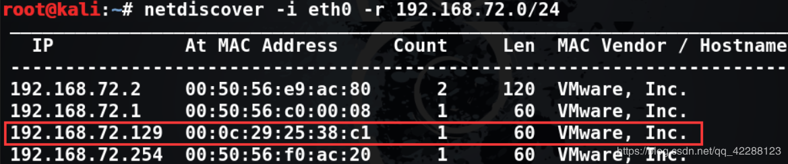

本文是对靶机DC-1渗透的关键点进行简单记录
# 信息收集
## 主机发现

## 端口扫描
先利用masscan快速确认开放端口，再用nmap确认端口服务


## 网站指纹扫描

## 目录扫描

## 浏览网站
访问目标网站查找有用信息
登陆网站就看到大大登陆界面，因此肯定先从这个登陆界面下手

在尝试进行sql万能密码登陆以及确认已注册用户并弱口令登陆失败后

使用wappalyzer插件进行查看网站指纹

看到内容管理系统使用了Drupal 7，尝试用搜索引擎查找是否存在高危漏洞
 

# 漏洞利用

在msf上搜索，发现了许多选相关漏洞利用的EXP
这里就将注意力放在漏洞利用模块（exploit）上，优先可以使用效果显著的excellent EXP


使用`unix/webapp/drupal_drupalgeddon2`，成功获得shell
查看系统信息

# 提权操作
内核版本大于`2.6.22`可以考虑使用脏牛提权，这个漏洞的覆盖面非常广，值得尝试，唯一的缺陷就是有可能提崩系统，因此在生产环境测试中还是要慎重使用。

没有成功也别灰心，还有其他方法。
这里就简单讲一下linux提权，正好作为对以前学习的复习
```
提权分类：系统提权、第三方软件提权
系统提权是利用了系统的弱点和漏洞进行提权
第三方软件提权是利用了系统上安装的第三方软件的漏洞或后门来进行提权
```
简单的系统提权就是因管理员的配置不当造成**sudo误配**和**SUID滥用**，这两个肯定需要首先拿出来尝试，原因就是操作简单、成功率比较高。

其他的方法还有**内核栈溢出提权**、**搜寻配置文件中的明文密码**、**环境变量劫持高权限程序**

有个提高效率的小技巧就是，不论linux还是windows，在拿到shell可以先给目标机器上传一个提权检测脚本，然后在对方主机上运行后，根据提权脚本提示进行提权操作，脚本的选择需要跟据对方系统安装的编程语言决定。

**SUID提权**
搜索主机上拥有S权限的服务
>find / -perm -u=s -type f 2>/dev/null
>

发现find命令具有suid权限，因此在执行find的时候其实是用root身份在执行，因此可以尝试使用find命令进行提权 
先利用find调用`/bin/bash`，结果发现调用只是普通权限
>touch flag
>find / -type f -name flag -exec "/bin/bash" \;
>

利用find调用`/bin/sh`，提权成功
>find / -type f -name flag -exec "/bin/sh" \;
>

***
# 后记
DC-1的难点是在提权部分，这个靶机利用msf通过cms漏洞获得shell非常简单，就是提权这里能然我们学到不少东西

 **/bin/bash 与/bin/sh区别**
 

SH：
sh就是Bourne shell
这个是UNIX标准的默认shell，对它评价是concise简洁 compact紧凑 fast高效，由AT&T编写，属于系统管理shell

BASH:
bash是 GNU Bourne-Again SHell (GNU 命令解释程序 “Bourne二世”)
是linux标准的默认shell ，它基于Bourne shell，吸收了C shell和Korn shell的一些特性。bash是Bourne shell的超集，bash完全兼容Bourne shell,也就是说用Bourne shell的脚本不加修改可以在bash中执行，反过来却不行，bash的脚本在sh上运行容易报语法错误。

为什么会出现sh:
鉴于bash过于复杂，有人把bash从NetBSD移植到Linux并更名为dash (Debian Almquist Shell)，并建议将/bin/sh指向它，以获得更快的脚本执行速度。Dash Shell 比Bash Shell小的多，符合POSIX标准Ubuntu继承了Debian，所以从Ubuntu 6.10开始默认是Dash Shell。
Debian曾经采用/bin/bash更改/bin/dash，目的使用更少的磁盘空间、提供较少的功能、获取更快的速度，但是后来经过shell脚本测试存在运行问题。因为原先在bash shell下可以运行的shell script (shell 脚本)，在/bin/sh下还是会出现一些意想不到的问题，不是100%的兼用。

[参考资料：#!/bin/bash和#!/bin/sh的区别](https://www.jianshu.com/p/070bd0b4855f)

**Set UID**
 1. SUID权限仅对可执行文件有效
 2. 执行者对于该可执行文件需要具有x权限
 3. 在执行过程中，调用者会暂时获得该文件的拥有者权限
 4. 该权限只在程序执行的过程中有效

**Set GID**

 1. 既可以作用于目录，也可以作用于可执行文件
 2. 只要父目录有SGID权限，所有的子目录都会递归继承
 3. 执行者对于该可执行文件需要具有x权限
 4. 在执行过程中，调用者会暂时获得该文件的所属组权限